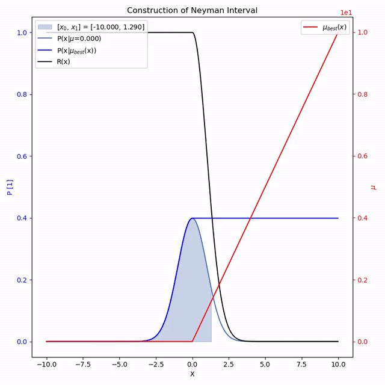

# Feldman-Cousins-visualizations
Visualizations for Feldman-Cousins method for creation of Confidence intervals for nonnegative gaussian signal

## Running
`$ python code/plot_fc_multiple_gaussian.py`  
`$ python code/plot_fc_gaussian.py` 
`$ python code/plot_ratio_poisson_ex.py`   

## Output
  
Feldman-Cousins intervals constructed at 1, 2, 3, and 4 $\sigma$ for a gaussian with nonnegative $\mu$.

  
Feldman-Cousins confidence intervals for $\mu$ given $x_0$.

